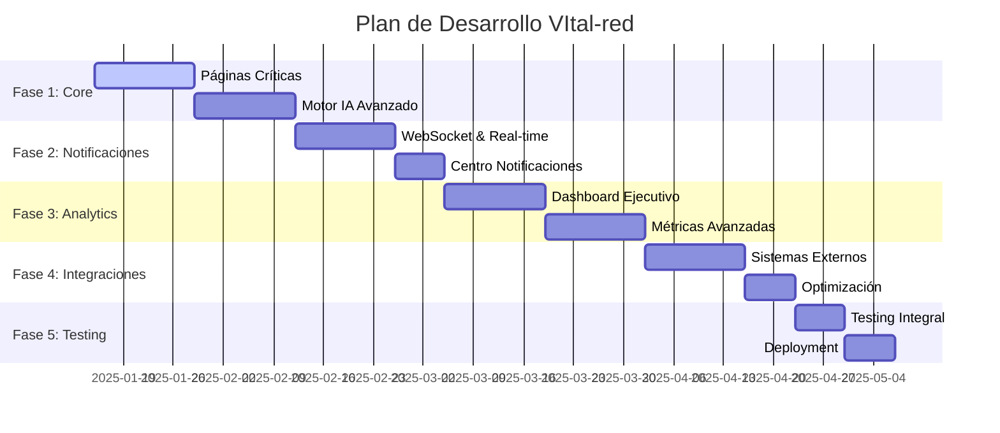

# PLAN DE DESARROLLO COMPLETO - SISTEMA VITAL-RED
## AUTOMATIZACIÓN DE REFERENCIAS MÉDICAS CON INTELIGENCIA ARTIFICIAL

### VERSIÓN: 2.0 - SISTEMA BINARIO ROJO-VERDE
### FECHA: Enero 2025

---

## TABLA DE CONTENIDOS

1. [RESUMEN EJECUTIVO](#resumen-ejecutivo)
2. [ANÁLISIS DEL ESTADO ACTUAL](#análisis-del-estado-actual)
3. [ARQUITECTURA TÉCNICA DETALLADA](#arquitectura-técnica-detallada)
4. [COMPONENTES FALTANTES IDENTIFICADOS](#componentes-faltantes-identificados)
5. [PLAN DE DESARROLLO POR FASES](#plan-de-desarrollo-por-fases)
6. [ESPECIFICACIONES TÉCNICAS DETALLADAS](#especificaciones-técnicas-detalladas)
7. [CRONOGRAMA DE IMPLEMENTACIÓN](#cronograma-de-implementación)
8. [RECURSOS Y PRESUPUESTO](#recursos-y-presupuesto)
9. [MÉTRICAS Y KPIs](#métricas-y-kpis)
10. [PLAN DE PRUEBAS](#plan-de-pruebas)
11. [DOCUMENTACIÓN Y CAPACITACIÓN](#documentación-y-capacitación)

---

## RESUMEN EJECUTIVO

### Contexto del Proyecto
El sistema VItal-red es una plataforma revolucionaria de automatización de referencias médicas que utiliza Inteligencia Artificial para optimizar el proceso de gestión de remisiones de pacientes en un hospital de alta complejidad del Valle del Cauca, Colombia. El sistema maneja aproximadamente 1,000 solicitudes diarias, clasificándolas automáticamente en dos categorías de prioridad: **ROJO** (Alta Prioridad) y **VERDE** (Baja Prioridad).

### Objetivos Estratégicos
- **Automatizar** el 100% del proceso de clasificación de referencias médicas
- **Reducir** el tiempo de respuesta de 24-48 horas a respuesta inmediata
- **Optimizar** la utilización de recursos humanos especializados
- **Mejorar** la oportunidad de atención médica para casos críticos
- **Generar** inteligencia de negocio para toma de decisiones estratégicas

### Beneficios Esperados
- **Eficiencia Operativa**: Procesamiento de 1,000 solicitudes diarias vs. 500-600 actuales
- **Respuesta Inmediata**: 700 casos con respuesta automática instantánea
- **Optimización de Recursos**: Reducción de carga manual de 1,000 a 300 casos diarios
- **Mejora en Outcomes**: Identificación inmediata de casos críticos

---

## ANÁLISIS DEL ESTADO ACTUAL

### Componentes Existentes Identificados

#### 1. **BACKEND - Laravel/PHP**
```
✅ Modelos de Datos Implementados:
- User.php (Sistema de usuarios y roles)
- SolicitudReferencia.php (Solicitudes de referencia)
- RegistroMedico.php (Registros médicos de pacientes)
- DecisionReferencia.php (Decisiones médicas)
- IPS.php (Instituciones prestadoras de servicios)
- ConfiguracionIA.php (Configuración del algoritmo)
- Notificacion.php (Sistema de notificaciones)
- SeguimientoPaciente.php (Seguimiento de casos)

✅ Servicios Implementados:
- GeminiAIService.php (Integración con IA de Google)

✅ Migraciones de Base de Datos:
- Sistema completo de tablas relacionales
- Estructura de roles y permisos
- Configuración de IA
```

#### 2. **FRONTEND - React/TypeScript/Inertia.js**
```
✅ Páginas Implementadas:

ADMINISTRADOR:
- ConfigurarIA.tsx (Configuración del algoritmo IA)
- DashboardReferencias.tsx (Dashboard ejecutivo)
- PermisosUsuario.tsx (Gestión de permisos)
- Reportes.tsx (Reportes y métricas)
- supervision.tsx (Supervisión del sistema)
- usuarios.tsx (Gestión de usuarios)

IPS EXTERNA:
- MisSolicitudes.tsx (Historial de solicitudes)
- SolicitarReferencia.tsx (Formulario de nueva referencia)

MÉDICO/CENTRO DE REFERENCIA:
- GestionarReferencias.tsx (Gestión operativa)
- consulta-pacientes.tsx (Consulta de pacientes)
- ingresar-registro.tsx (Ingreso de registros)
- SeguimientoPacientes.tsx (Seguimiento de casos)

COMPARTIDAS:
- dashboard.tsx (Dashboard principal por roles)
- welcome.tsx (Página de bienvenida)
```

#### 3. **COMPONENTES UI**
```
✅ Componentes Base:
- Sistema completo de UI components (shadcn/ui)
- Componentes especializados para referencias médicas
- Sistema de notificaciones
- Componentes de navegación y layout

✅ Componentes Especializados:
- DateRangeFilter.tsx
- DecisionModal.tsx
- ExportButton.tsx
- PriorityBadge.tsx
- ReportChart.tsx
- SolicitudCard.tsx
- SpecialtyFilter.tsx
- StatusTracker.tsx
- TimeIndicator.tsx
```

### Funcionalidades Implementadas

#### ✅ **SISTEMA DE ROLES Y PERMISOS**
- **Administrador**: Acceso completo al sistema
- **Jefe de Urgencias**: Dashboard ejecutivo y métricas
- **Centro de Referencia**: Gestión operativa de solicitudes
- **Médico**: Ingreso de registros y gestión de referencias
- **IPS Externa**: Creación y seguimiento de solicitudes

#### ✅ **MOTOR DE INTELIGENCIA ARTIFICIAL**
- Integración con Google Gemini AI
- Configuración de pesos del algoritmo
- Criterios de clasificación ROJO/VERDE
- Sistema de scoring automático

#### ✅ **GESTIÓN DE SOLICITUDES**
- Formulario completo de ingreso de referencias
- Sistema de seguimiento de estados
- Gestión de decisiones médicas
- Historial completo de casos

#### ✅ **DASHBOARD Y REPORTES**
- Métricas en tiempo real
- Reportes por especialidad
- Análisis de tendencias
- Exportación de datos

---

## COMPONENTES FALTANTES IDENTIFICADOS

### 1. **PÁGINAS FALTANTES**

#### **ADMINISTRADOR**
```
❌ FALTANTES:
- /admin/usuarios-completo (Gestión avanzada de usuarios)
- /admin/reportes-completos (Reportes ejecutivos detallados)
- /admin/configurar-ia-completo (Configuración avanzada de IA)
- /admin/auditoria (Logs y auditoría del sistema)
- /admin/configuracion-sistema (Configuración general)
```

#### **JEFE DE URGENCIAS**
```
❌ FALTANTES:
- /jefe-urgencias/metricas (Métricas en tiempo real)
- /jefe-urgencias/dashboard-ejecutivo (Dashboard especializado)
- /jefe-urgencias/alertas-criticas (Sistema de alertas)
- /jefe-urgencias/analisis-predictivo (Análisis predictivo)
```

#### **MÉDICO/CENTRO DE REFERENCIA**
```
❌ FALTANTES:
- /medico/casos-criticos (Gestión de casos ROJOS)
- /medico/respuestas-automaticas (Gestión de respuestas VERDES)
- /medico/estadisticas-personales (Métricas individuales)
- /medico/calendario-citas (Programación de citas)
```

#### **COMPARTIDAS**
```
❌ FALTANTES:
- /shared/notificaciones (Centro de notificaciones)
- /shared/ayuda (Sistema de ayuda y documentación)
- /shared/configuracion-perfil (Configuración de perfil avanzada)
```

### 2. **FUNCIONALIDADES CRÍTICAS FALTANTES**

#### **SISTEMA DE NOTIFICACIONES EN TIEMPO REAL**
```
❌ Notificaciones push para casos ROJOS
❌ Alertas automáticas por timeouts
❌ Notificaciones por email/SMS
❌ Sistema de escalamiento automático
```

#### **MOTOR DE IA AVANZADO**
```
❌ Procesamiento de documentos PDF/imágenes
❌ Análisis de texto médico avanzado
❌ Aprendizaje automático continuo
❌ Validación médica del algoritmo
```

#### **SISTEMA DE RESPUESTAS AUTOMÁTICAS**
```
❌ Generación automática de respuestas para casos VERDES
❌ Plantillas personalizables por especialidad
❌ Sistema de comunicación con IPS
❌ Seguimiento de respuestas enviadas
```

#### **ANALYTICS Y BUSINESS INTELLIGENCE**
```
❌ Dashboard ejecutivo en tiempo real
❌ Análisis predictivo de demanda
❌ Reportes de eficiencia del algoritmo
❌ Métricas de satisfacción de usuarios
```

### 3. **INTEGRACIONES FALTANTES**

#### **SISTEMAS EXTERNOS**
```
❌ Integración con HIS (Hospital Information System)
❌ Conexión con sistemas de laboratorio
❌ Integración con PACS (Picture Archiving System)
❌ APIs para sistemas de facturación
```

#### **SERVICIOS DE COMUNICACIÓN**
```
❌ Servicio de email automatizado
❌ Integración con SMS gateway
❌ Sistema de notificaciones push
❌ Integración con WhatsApp Business API
```

---

## ARQUITECTURA TÉCNICA DETALLADA

### Stack Tecnológico Actual
```
Backend: Laravel 11 + PHP 8.2
Frontend: React 18 + TypeScript + Inertia.js
Base de Datos: MySQL/PostgreSQL
IA: Google Gemini AI
UI: Tailwind CSS + shadcn/ui
Autenticación: Laravel Breeze
```

### Arquitectura de Microservicios Propuesta

#### **1. SERVICIO PRINCIPAL (CORE)**
```
Responsabilidades:
- Gestión de usuarios y autenticación
- Manejo de solicitudes de referencia
- Coordinación entre servicios
- API Gateway principal

Tecnologías:
- Laravel 11 (API)
- MySQL (Base de datos principal)
- Redis (Cache y sesiones)
```

#### **2. SERVICIO DE INTELIGENCIA ARTIFICIAL**
```
Responsabilidades:
- Procesamiento de documentos médicos
- Clasificación automática ROJO/VERDE
- Análisis de texto médico
- Aprendizaje continuo

Tecnologías:
- Python + FastAPI
- TensorFlow/PyTorch
- Google Gemini AI
- PostgreSQL (Datos de entrenamiento)
```

#### **3. SERVICIO DE NOTIFICACIONES**
```
Responsabilidades:
- Notificaciones en tiempo real
- Email y SMS automatizados
- Push notifications
- Sistema de escalamiento

Tecnologías:
- Node.js + Express
- Socket.io (WebSockets)
- Redis (Message Queue)
- SendGrid/Twilio APIs
```

#### **4. SERVICIO DE ANALYTICS**
```
Responsabilidades:
- Procesamiento de métricas
- Generación de reportes
- Análisis predictivo
- Business Intelligence

Tecnologías:
- Python + Django
- Apache Spark
- InfluxDB (Time series)
- Grafana (Visualización)
```

#### **5. SERVICIO DE DOCUMENTOS**
```
Responsabilidades:
- Procesamiento de PDFs
- OCR de imágenes médicas
- Almacenamiento de archivos
- Extracción de datos

Tecnologías:
- Python + Flask
- Tesseract OCR
- AWS S3/MinIO
- Apache Tika
```

---

## PLAN DE DESARROLLO POR FASES

### **FASE 1: COMPLETAR FUNCIONALIDADES CORE (4 semanas)**

#### Semana 1-2: Páginas Faltantes Críticas
```
PRIORIDAD ALTA:

1. Jefe de Urgencias - Dashboard Ejecutivo
   - Métricas en tiempo real
   - Alertas críticas
   - Análisis de tendencias

2. Médico - Gestión de Casos Críticos
   - Lista priorizada de casos ROJOS
   - Herramientas de decisión rápida
   - Seguimiento de timeouts

3. Sistema de Respuestas Automáticas
   - Generador de respuestas para casos VERDES
   - Plantillas personalizables
   - Envío automático
```

#### Semana 3-4: Optimización del Motor de IA
```
MEJORAS CRÍTICAS:

1. Algoritmo de Clasificación Avanzado
   - Refinamiento de pesos
   - Validación médica
   - Casos de prueba

2. Procesamiento de Documentos
   - OCR para imágenes
   - Extracción de datos PDF
   - Análisis de texto médico

3. Sistema de Aprendizaje Continuo
   - Feedback loop médico
   - Mejora automática del algoritmo
   - Métricas de precisión
```

### **FASE 2: SISTEMA DE NOTIFICACIONES Y COMUNICACIÓN (3 semanas)**

#### Semana 5-6: Notificaciones en Tiempo Real
```
IMPLEMENTACIONES:

1. WebSocket Server
   - Notificaciones push instantáneas
   - Alertas por casos críticos
   - Estado en tiempo real

2. Sistema de Email Automatizado
   - Plantillas profesionales
   - Respuestas automáticas
   - Seguimiento de entregas

3. Integración SMS
   - Alertas críticas por SMS
   - Confirmaciones de recepción
   - Escalamiento automático
```

#### Semana 7: Centro de Notificaciones
```
FUNCIONALIDADES:

1. Panel de Notificaciones
   - Historial completo
   - Filtros avanzados
   - Marcado de leído/no leído

2. Configuración de Alertas
   - Personalización por usuario
   - Horarios de notificación
   - Canales preferidos
```

### **FASE 3: ANALYTICS Y BUSINESS INTELLIGENCE (4 semanas)**

#### Semana 8-9: Dashboard Ejecutivo Avanzado
```
COMPONENTES:

1. Métricas en Tiempo Real
   - Volumen de solicitudes
   - Tiempos de respuesta
   - Eficiencia del algoritmo

2. Análisis Predictivo
   - Predicción de demanda
   - Identificación de tendencias
   - Alertas tempranas

3. Reportes Automatizados
   - Reportes diarios/semanales/mensuales
   - Exportación automática
   - Distribución por email
```

#### Semana 10-11: Sistema de Métricas Avanzadas
```
IMPLEMENTACIONES:

1. KPIs Personalizados
   - Métricas por especialidad
   - Eficiencia por médico
   - Satisfacción de IPS

2. Análisis de Outcomes
   - Seguimiento de casos
   - Análisis de resultados
   - Mejora continua
```

### **FASE 4: INTEGRACIONES Y OPTIMIZACIÓN (3 semanas)**

#### Semana 12-13: Integraciones Externas
```
CONEXIONES:

1. Sistema HIS
   - Sincronización de pacientes
   - Historial médico completo
   - Datos demográficos

2. Sistemas de Laboratorio
   - Resultados automáticos
   - Integración de reportes
   - Alertas por valores críticos

3. PACS Integration
   - Imágenes médicas
   - Reportes radiológicos
   - Análisis automático
```

#### Semana 14: Optimización y Performance
```
MEJORAS:

1. Optimización de Base de Datos
   - Índices optimizados
   - Consultas eficientes
   - Particionado de tablas

2. Cache Strategy
   - Redis para datos frecuentes
   - CDN para archivos estáticos
   - Cache de consultas IA

3. Monitoreo y Logging
   - APM (Application Performance Monitoring)
   - Logs estructurados
   - Alertas de performance
```

### **FASE 5: TESTING Y DEPLOYMENT (2 semanas)**

#### Semana 15: Testing Integral
```
PRUEBAS:

1. Unit Testing
   - Cobertura 90%+
   - Tests automatizados
   - CI/CD pipeline

2. Integration Testing
   - APIs endpoints
   - Flujos completos
   - Casos edge

3. Performance Testing
   - Load testing (1000+ usuarios)
   - Stress testing
   - Scalability testing

4. Security Testing
   - Penetration testing
   - Vulnerability assessment
   - OWASP compliance
```

#### Semana 16: Deployment y Go-Live
```
ACTIVIDADES:

1. Production Deployment
   - Blue-green deployment
   - Database migration
   - DNS cutover

2. Monitoring Setup
   - Health checks
   - Performance monitoring
   - Error tracking

3. User Training
   - Capacitación por roles
   - Documentación
   - Soporte inicial
```

---

## ESPECIFICACIONES TÉCNICAS DETALLADAS

### **1. MOTOR DE INTELIGENCIA ARTIFICIAL AVANZADO**

#### Algoritmo de Clasificación Binaria
```python
class MedicalReferenceClassifier:
    def __init__(self):
        self.weights = {
            'age_factor': 0.25,
            'severity_score': 0.40,
            'specialty_urgency': 0.20,
            'symptoms_criticality': 0.15
        }
    
    def classify_reference(self, medical_data):
        """
        Clasifica una referencia médica como ROJO o VERDE
        """
        score = self.calculate_priority_score(medical_data)
        
        if score >= 0.7:
            return {
                'priority': 'ROJO',
                'score': score,
                'reasoning': self.generate_reasoning(medical_data),
                'confidence': self.calculate_confidence(score)
            }
        else:
            return {
                'priority': 'VERDE',
                'score': score,
                'reasoning': self.generate_reasoning(medical_data),
                'confidence': self.calculate_confidence(score)
            }
```

#### Variables de Clasificación Críticas
```json
{
  "demographic_factors": {
    "age_groups": {
      "neonatal": {"weight": 1.0, "description": "0-28 días"},
      "pediatric": {"weight": 0.9, "description": "29 días - 18 años"},
      "adult": {"weight": 0.5, "description": "18-65 años"},
      "geriatric": {"weight": 0.8, "description": ">65 años"}
    },
    "pregnancy_status": {
      "pregnant": {"weight": 0.9, "description": "Gestante"},
      "high_risk_pregnancy": {"weight": 1.0, "description": "Embarazo alto riesgo"}
    }
  },
  "clinical_factors": {
    "vital_signs": {
      "blood_pressure": {"critical_threshold": "180/110", "weight": 0.8},
      "heart_rate": {"critical_threshold": ">120 or <50", "weight": 0.7},
      "temperature": {"critical_threshold": ">39°C", "weight": 0.6},
      "oxygen_saturation": {"critical_threshold": "<90%", "weight": 0.9}
    },
    "alarm_symptoms": {
      "chest_pain": {"weight": 0.9},
      "dyspnea": {"weight": 0.8},
      "altered_consciousness": {"weight": 1.0},
      "severe_bleeding": {"weight": 1.0},
      "neurological_deficit": {"weight": 0.9}
    }
  },
  "specialty_urgency": {
    "cardiology": {"base_urgency": 0.8},
    "neurology": {"base_urgency": 0.8},
    "oncology": {"base_urgency": 0.7},
    "emergency_surgery": {"base_urgency": 1.0},
    "intensive_care": {"base_urgency": 1.0}
  }
}
```

### **2. SISTEMA DE RESPUESTAS AUTOMÁTICAS**

#### Generador de Respuestas Inteligentes
```php
class AutomaticResponseGenerator
{
    public function generateResponse(SolicitudReferencia $solicitud): string
    {
        $template = $this->selectTemplate($solicitud);
        $personalizedContent = $this->personalizeContent($template, $solicitud);
        
        return $this->formatResponse($personalizedContent);
    }
    
    private function selectTemplate(SolicitudReferencia $solicitud): ResponseTemplate
    {
        $specialty = $solicitud->registro_medico->especialidad_solicitada;
        $reason = $this->determineRejectionReason($solicitud);
        
        return ResponseTemplate::where('specialty', $specialty)
            ->where('reason', $reason)
            ->first();
    }
    
    private function personalizeContent(ResponseTemplate $template, SolicitudReferencia $solicitud): string
    {
        return str_replace([
            '{patient_name}',
            '{doctor_name}',
            '{ips_name}',
            '{specialty}',
            '{date}',
            '{alternative_recommendations}'
        ], [
            $solicitud->registro_medico->nombre_completo,
            $solicitud->medico_remitente,
            $solicitud->ips->nombre,
            $solicitud->registro_medico->especialidad_solicitada,
            now()->format('d/m/Y'),
            $this->getAlternativeRecommendations($solicitud)
        ], $template->content);
    }
}
```

#### Plantillas de Respuesta por Especialidad
```json
{
  "response_templates": {
    "no_capacity": {
      "cardiology": {
        "subject": "Referencia {codigo_solicitud} - No disponibilidad de cupos",
        "content": "Estimado Dr. {doctor_name},\n\nHemos recibido su solicitud de referencia para el paciente {patient_name} a la especialidad de Cardiología.\n\nActualmente no contamos con disponibilidad de cupos para atención electiva en esta especialidad. Le sugerimos:\n\n1. Continuar manejo en su nivel de atención\n2. Contactar IPS de segundo nivel más cercana\n3. En caso de urgencia, dirigirse directamente a urgencias\n\nAtentamente,\nCentro de Referencia y Contrarreferencia"
      }
    },
    "insufficient_complexity": {
      "general": {
        "subject": "Referencia {codigo_solicitud} - Manejo en menor nivel de complejidad",
        "content": "Estimado Dr. {doctor_name},\n\nDespués de revisar la solicitud para el paciente {patient_name}, consideramos que el caso puede ser manejado en un nivel de menor complejidad.\n\nRecomendaciones:\n{alternative_recommendations}\n\nQuedamos atentos a cualquier consulta.\n\nAtentamente,\nCentro de Referencia y Contrarreferencia"
      }
    }
  }
}
```

### **3. DASHBOARD EJECUTIVO EN TIEMPO REAL**

#### Componente de Métricas en Tiempo Real
```typescript
interface RealTimeMetrics {
  totalSolicitudes: number;
  solicitudesPendientes: number;
  casosRojos: number;
  casosVerdes: number;
  tiempoPromedioRespuesta: number;
  eficienciaAlgoritmo: number;
  especialidadesMasDemandadas: SpecialtyMetric[];
  alertasCriticas: CriticalAlert[];
}

const RealTimeDashboard: React.FC = () => {
  const [metrics, setMetrics] = useState<RealTimeMetrics>();
  const [isConnected, setIsConnected] = useState(false);

  useEffect(() => {
    // Conexión WebSocket para métricas en tiempo real
    const socket = io('/metrics');
    
    socket.on('connect', () => setIsConnected(true));
    socket.on('metrics_update', (data: RealTimeMetrics) => {
      setMetrics(data);
    });
    
    socket.on('critical_alert', (alert: CriticalAlert) => {
      // Mostrar alerta crítica
      toast.error(`Alerta Crítica: ${alert.message}`);
    });

    return () => socket.disconnect();
  }, []);

  return (
    <div className="grid grid-cols-1 md:grid-cols-2 lg:grid-cols-4 gap-6">
      <MetricCard
        title="Solicitudes Hoy"
        value={metrics?.totalSolicitudes || 0}
        trend="+12%"
        icon={<FileText />}
      />
      
      <MetricCard
        title="Casos ROJOS"
        value={metrics?.casosRojos || 0}
        trend="-5%"
        icon={<AlertTriangle />}
        color="red"
      />
      
      <MetricCard
        title="Tiempo Promedio"
        value={`${metrics?.tiempoPromedioRespuesta || 0}h`}
        trend="-15%"
        icon={<Clock />}
      />
      
      <MetricCard
        title="Eficiencia IA"
        value={`${metrics?.eficienciaAlgoritmo || 0}%`}
        trend="+3%"
        icon={<Brain />}
        color="green"
      />
    </div>
  );
};
```

### **4. SISTEMA DE NOTIFICACIONES AVANZADO**

#### Servicio de Notificaciones en Tiempo Real
```javascript
// notification-service.js
class NotificationService {
  constructor() {
    this.io = require('socket.io')(server);
    this.redis = require('redis').createClient();
    this.emailService = new EmailService();
    this.smsService = new SMSService();
  }

  async sendCriticalAlert(solicitudId, userId, message) {
    const user = await User.findById(userId);
    
    // WebSocket notification
    this.io.to(`user_${userId}`).emit('critical_alert', {
      solicitudId,
      message,
      timestamp: new Date(),
      type: 'CRITICAL'
    });
    
    // Email notification
    if (user.email_notifications) {
      await this.emailService.sendCriticalAlert(user.email, message);
    }
    
    // SMS notification for critical cases
    if (user.sms_notifications && user.phone) {
      await this.smsService.sendAlert(user.phone, message);
    }
    
    // Store in database for history
    await Notification.create({
      user_id: userId,
      solicitud_id: solicitudId,
      message,
      type: 'CRITICAL',
      channels: ['websocket', 'email', 'sms'],
      sent_at: new Date()
    });
  }

  async processTimeoutAlerts() {
    // Buscar casos que están por vencer
    const expiringSoon = await SolicitudReferencia.findExpiringSoon();
    
    for (const solicitud of expiringSoon) {
      await this.sendTimeoutWarning(solicitud);
    }
  }
}
```

### **5. ANÁLISIS PREDICTIVO Y MACHINE LEARNING**

#### Modelo de Predicción de Demanda
```python
import pandas as pd
from sklearn.ensemble import RandomForestRegressor
from sklearn.preprocessing import StandardScaler
import joblib

class DemandPredictionModel:
    def __init__(self):
        self.model = RandomForestRegressor(n_estimators=100, random_state=42)
        self.scaler = StandardScaler()
        self.is_trained = False
    
    def prepare_features(self, data):
        """
        Prepara las características para el modelo predictivo
        """
        features = pd.DataFrame({
            'day_of_week': data['fecha'].dt.dayofweek,
            'month': data['fecha'].dt.month,
            'hour': data['fecha'].dt.hour,
            'specialty_encoded': pd.Categorical(data['especialidad']).codes,
            'historical_avg': data['promedio_historico'],
            'seasonal_factor': data['factor_estacional']
        })
        
        return self.scaler.fit_transform(features)
    
    def train(self, historical_data):
        """
        Entrena el modelo con datos históricos
        """
        X = self.prepare_features(historical_data)
        y = historical_data['numero_solicitudes']
        
        self.model.fit(X, y)
        self.is_trained = True
        
        # Guardar modelo entrenado
        joblib.dump(self.model, 'demand_prediction_model.pkl')
        joblib.dump(self.scaler, 'demand_scaler.pkl')
    
    def predict_demand(self, date, specialty):
        """
        Predice la demanda para una fecha y especialidad específica
        """
        if not self.is_trained:
            raise ValueError("Model must be trained first")
        
        # Preparar datos de entrada
        input_data = pd.DataFrame({
            'fecha': [date],
            'especialidad': [specialty],
            'promedio_historico': [self.get_historical_average(specialty)],
            'factor_estacional': [self.get_seasonal_factor(date)]
        })
        
        X = self.prepare_features(input_data)
        prediction = self.model.predict(X)
        
        return {
            'predicted_demand': int(prediction[0]),
            'confidence_interval': self.calculate_confidence_interval(X),
            'factors': self.get_prediction_factors(X)
        }
```

---

## CRONOGRAMA DE IMPLEMENTACIÓN

### **CRONOGRAMA DETALLADO - 16 SEMANAS**



### **HITOS CRÍTICOS**

| Semana | Hito | Entregables | Criterios de Aceptación |
|--------|------|-------------|------------------------|
| 2 | Dashboard Jefe Urgencias | Métricas tiempo real, alertas críticas | 100% casos ROJOS visibles en <2 segundos |
| 4 | Motor IA Optimizado | Algoritmo refinado, validación médica | 95% precisión en clasificación |
| 7 | Sistema Notificaciones | WebSocket, email, SMS | Notificaciones <1 segundo |
| 11 | Analytics Completo | Reportes, predicción, KPIs | Dashboards actualizados cada 5 min |
| 14 | Integraciones HIS | Conexión sistemas externos | Sincronización automática 24/7 |
| 16 | Go-Live | Sistema completo en producción | 1000+ solicitudes/día procesadas |

---

## RECURSOS Y PRESUPUESTO

### **EQUIPO DE DESARROLLO**

#### **Equipo Core (16 semanas)**
```
👨‍💼 Project Manager (1)
- Coordinación general del proyecto
- Gestión de stakeholders
- Control de cronograma y presupuesto

👨‍💻 Tech Lead / Arquitecto (1)
- Arquitectura técnica
- Revisión de código
- Decisiones tecnológicas

👨‍💻 Desarrolladores Backend (2)
- Laravel/PHP development
- APIs y microservicios
- Base de datos

👨‍💻 Desarrolladores Frontend (2)
- React/TypeScript
- UI/UX implementation
- Integración con APIs

🤖 Especialista en IA/ML (1)
- Algoritmos de machine learning
- Procesamiento de lenguaje natural
- Optimización de modelos

🔧 DevOps Engineer (1)
- Infraestructura cloud
- CI/CD pipelines
- Monitoreo y logging

🧪 QA Engineer (1)
- Testing automatizado
- Pruebas de integración
- Control de calidad

👨‍⚕️ Consultor Médico (1)
- Validación clínica
- Definición de criterios médicos
- Capacitación del equipo
```

#### **Costos Estimados (16 semanas)**
```
RECURSOS HUMANOS:
- Project Manager: $8,000 USD
- Tech Lead: $12,000 USD
- Backend Developers (2): $16,000 USD
- Frontend Developers (2): $16,000 USD
- AI/ML Specialist: $10,000 USD
- DevOps Engineer: $8,000 USD
- QA Engineer: $6,000 USD
- Medical Consultant: $4,000 USD

SUBTOTAL RECURSOS HUMANOS: $80,000 USD

INFRAESTRUCTURA Y SERVICIOS:
- Cloud Infrastructure (AWS/Azure): $2,000 USD
- Third-party APIs (Gemini AI, SMS, Email): $1,500 USD
- Development Tools & Licenses: $1,000 USD
- Testing & Monitoring Tools: $800 USD

SUBTOTAL INFRAESTRUCTURA: $5,300 USD

TOTAL PROYECTO: $85,300 USD
```

### **INFRAESTRUCTURA TÉCNICA**

#### **Ambiente de Desarrollo**
```yaml
development:
  servers:
    - app_server: 2 vCPU, 4GB RAM
    - database: 2 vCPU, 8GB RAM
    - redis: 1 vCPU, 2GB RAM
  
  services:
    - Laravel application
    - MySQL database
    - Redis cache
    - Node.js notification service
```

#### **Ambiente de Producción**
```yaml
production:
  load_balancer:
    - nginx: 2 instances
  
  app_servers:
    - web_app: 4 vCPU, 8GB RAM (2 instances)
    - api_server: 4 vCPU, 8GB RAM (2 instances)
  
  databases:
    - mysql_primary: 8 vCPU, 16GB RAM
    - mysql_replica: 4 vCPU, 8GB RAM
    - redis_cluster: 3 nodes, 4GB RAM each
  
  ai_services:
    - ml_processor: 8 vCPU, 16GB RAM, GPU
    - document_processor: 4 vCPU, 8GB RAM
  
  monitoring:
    - prometheus: 2 vCPU, 4GB RAM
    - grafana: 2 vCPU, 4GB RAM
    - elasticsearch: 4 vCPU, 8GB RAM
```

---

## MÉTRICAS Y KPIs

### **KPIs OPERACIONALES**

#### **Eficiencia del Sistema**
```json
{
  "processing_metrics": {
    "daily_volume": {
      "target": 1000,
      "current": 600,
      "improvement": "67% increase needed"
    },
    "response_time": {
      "target": "< 2 hours for RED cases",
      "current": "24-48 hours",
      "improvement": "92% reduction needed"
    },
    "automation_rate": {
      "target": "70% automated responses",
      "current": "0% automated",
      "improvement": "700 cases/day automated"
    }
  }
}
```

#### **Calidad del Algoritmo IA**
```json
{
  "ai_performance": {
    "classification_accuracy": {
      "target": "> 95%",
      "baseline": "85%",
      "measurement": "Weekly validation with medical experts"
    },
    "false_positive_rate": {
      "target": "< 3%",
      "measurement": "RED cases incorrectly classified"
    },
    "false_negative_rate": {
      "target": "< 1%",
      "measurement": "GREEN cases that should be RED"
    }
  }
}
```

#### **Satisfacción de Usuarios**
```json
{
  "user_satisfaction": {
    "ips_satisfaction": {
      "target": "> 90%",
      "measurement": "Monthly surveys to referring institutions"
    },
    "medical_staff_satisfaction": {
      "target": "> 85%",
      "measurement": "Quarterly internal surveys"
    },
    "system_usability": {
      "target": "SUS Score > 80",
      "measurement": "System Usability Scale assessment"
    }
  }
}
```

### **DASHBOARD DE KPIs EN TIEMPO REAL**

#### **Métricas Principales**
```typescript
interface KPIDashboard {
  realTimeMetrics: {
    casesProcessedToday: number;
    averageResponseTime: string;
    redCasesPending: number;
    systemUptime: string;
    aiAccuracy: number;
  };
  
  trends: {
    weeklyVolume: number[];
    monthlyEfficiency: number[];
    specialtyDistribution: SpecialtyMetric[];
  };
  
  alerts: {
    criticalCases: CriticalCase[];
    systemAlerts: SystemAlert[];
    performanceWarnings: PerformanceWarning[];
  };
}
```

---

## PLAN DE PRUEBAS

### **ESTRATEGIA DE TESTING**

#### **1. Unit Testing (Cobertura 90%+)**
```php
// Ejemplo de test para el clasificador IA
class AIClassifierTest extends TestCase
{
    public function test_classifies_critical_case_as_red()
    {
        $medicalData = [
            'age' => 2, // Pediatric
            'symptoms' => ['chest_pain', 'dyspnea'],
            'vital_signs' => ['heart_rate' => 150],
            'specialty' => 'cardiology'
        ];
        
        $classifier = new MedicalReferenceClassifier();
        $result = $classifier->classify($medicalData);
        
        $this->assertEquals('ROJO', $result['priority']);
        $this->assertGreaterThan(0.7, $result['score']);
    }
    
    public function test_generates_appropriate_response_for_green_case()
    {
        $solicitud = SolicitudReferencia::factory()->green()->create();
        
        $generator = new AutomaticResponseGenerator();
        $response = $generator->generateResponse($solicitud);
        
        $this->assertStringContainsString($solicitud->registro_medico->nombre, $response);
        $this->assertStringContainsString('no contamos con disponibilidad', $response);
    }
}
```

#### **2. Integration Testing**
```javascript
// Ejemplo de test de integración para notificaciones
describe('Notification System Integration', () => {
  test('sends real-time notification for critical case', async () => {
    const mockSocket = new MockSocket();
    const notificationService = new NotificationService(mockSocket);
    
    const criticalCase = {
      id: 123,
      priority: 'ROJO',
      patient: 'Juan Pérez',
      specialty: 'Cardiología'
    };
    
    await notificationService.sendCriticalAlert(criticalCase);
    
    expect(mockSocket.emit).toHaveBeenCalledWith('critical_alert', {
      caseId: 123,
      message: expect.stringContaining('Juan Pérez'),
      type: 'CRITICAL'
    });
  });
});
```

#### **3. Performance Testing**
```yaml
# Configuración de pruebas de carga con Artillery
config:
  target: 'https://vital-red.hospital.com'
  phases:
    - duration: 300  # 5 minutos
      arrivalRate: 10  # 10 usuarios por segundo
    - duration: 600  # 10 minutos
      arrivalRate: 50  # 50 usuarios por segundo
    - duration: 300  # 5 minutos
      arrivalRate: 100 # 100 usuarios por segundo

scenarios:
  - name: "Submit Reference Request"
    weight: 60
    flow:
      - post:
          url: "/api/referencias"
          json:
            paciente: "{{ $randomString() }}"
            especialidad: "Cardiología"
            motivo: "Dolor torácico"
  
  - name: "Check Dashboard"
    weight: 40
    flow:
      - get:
          url: "/api/dashboard/metrics"
```

#### **4. Security Testing**
```bash
# Pruebas de seguridad automatizadas
# OWASP ZAP scan
zap-baseline.py -t https://vital-red.hospital.com

# SQL Injection testing
sqlmap -u "https://vital-red.hospital.com/api/referencias?id=1" --batch

# XSS testing
python3 xsser.py -u "https://vital-red.hospital.com/search" -p "query"
```

### **CRITERIOS DE ACEPTACIÓN**

#### **Performance**
- ✅ Sistema debe procesar 1000+ solicitudes simultáneas
- ✅ Tiempo de respuesta API < 200ms para 95% de requests
- ✅ Clasificación IA debe completarse en < 5 segundos
- ✅ Dashboard debe cargar en < 3 segundos

#### **Funcionalidad**
- ✅ 100% de casos ROJOS deben generar alerta inmediata
- ✅ 100% de casos VERDES deben recibir respuesta automática
- ✅ Sistema debe mantener 99.9% uptime
- ✅ Todas las notificaciones deben entregarse en < 30 segundos

#### **Seguridad**
- ✅ Autenticación multifactor para usuarios administrativos
- ✅ Encriptación end-to-end para datos médicos
- ✅ Logs de auditoría para todas las acciones críticas
- ✅ Cumplimiento con normativas de protección de datos

---

## DOCUMENTACIÓN Y CAPACITACIÓN

### **DOCUMENTACIÓN TÉCNICA**

#### **1. Documentación de Arquitectura**
```markdown
# Arquitectura del Sistema VItal-red

## Visión General
El sistema VItal-red implementa una arquitectura de microservicios...

## Componentes Principales
- **Core Service**: Gestión principal de solicitudes
- **AI Service**: Motor de inteligencia artificial
- **Notification Service**: Sistema de notificaciones
- **Analytics Service**: Procesamiento de métricas

## Flujos de Datos
[Diagramas de flujo detallados]

## APIs
[Documentación completa de endpoints]
```

#### **2. Manual de Usuario por Rol**

##### **Manual para IPS Externa**
```markdown
# Manual de Usuario - IPS Externa

## Acceso al Sistema
1. Ingrese a https://vital-red.hospital.com
2. Use sus credenciales proporcionadas
3. Seleccione "IPS Externa" como tipo de usuario

## Crear Nueva Solicitud
1. Click en "Solicitar Referencia"
2. Complete los datos del paciente
3. Adjunte documentos médicos
4. Envíe la solicitud

## Seguimiento de Solicitudes
1. Acceda a "Mis Solicitudes"
2. Filtre por estado o fecha
3. Click en "Ver Detalle" para más información
```

##### **Manual para Médico Especialista**
```markdown
# Manual de Usuario - Médico Especialista

## Dashboard Principal
- Visualice casos asignados por prioridad
- Revise alertas críticas
- Acceda a métricas personales

## Gestión de Casos ROJOS
1. Los casos críticos aparecen destacados
2. Tiempo límite de respuesta: 2 horas
3. Use el botón "Decidir" para aceptar/rechazar

## Herramientas de Decisión
- Historial médico completo
- Recomendaciones del algoritmo IA
- Consulta con otros especialistas
```

### **PROGRAMA DE CAPACITACIÓN**

#### **Fase 1: Capacitación Básica (Semana 15)**
```
AUDIENCIA: Todos los usuarios
DURACIÓN: 4 horas
MODALIDAD: Virtual + Presencial

CONTENIDO:
- Introducción al sistema VItal-red
- Navegación básica
- Roles y permisos
- Seguridad y privacidad

ENTREGABLES:
- Manual de usuario básico
- Videos tutoriales
- Certificado de capacitación
```

#### **Fase 2: Capacitación Especializada (Semana 16)**
```
AUDIENCIA: Por roles específicos
DURACIÓN: 6 horas por rol
MODALIDAD: Presencial con práctica

MÉDICOS ESPECIALISTAS:
- Gestión de casos críticos
- Herramientas de decisión
- Interpretación de recomendaciones IA

IPS EXTERNAS:
- Creación de solicitudes efectivas
- Documentación requerida
- Seguimiento de casos

ADMINISTRADORES:
- Configuración del sistema
- Gestión de usuarios
- Monitoreo y reportes
```

#### **Fase 3: Soporte Continuo**
```
SOPORTE TÉCNICO:
- Help desk 24/7 para casos críticos
- Chat en vivo durante horario laboral
- Base de conocimientos online

ACTUALIZACIONES:
- Webinars mensuales sobre nuevas funcionalidades
- Newsletter con tips y mejores prácticas
- Sesiones de feedback trimestral
```

---

## CONCLUSIONES Y PRÓXIMOS PASOS

### **IMPACTO ESPERADO DEL PROYECTO**

#### **Transformación Operacional**
El sistema VItal-red representa una transformación digital completa del proceso de referencias médicas, con impacto directo en:

- **Eficiencia**: Aumento del 67% en capacidad de procesamiento
- **Oportunidad**: Reducción del 92% en tiempo de respuesta para casos críticos
- **Calidad**: Mejora en la precisión de clasificación médica
- **Satisfacción**: Mayor satisfacción de pacientes y profesionales médicos

#### **Beneficios Cuantificables**
```
MÉTRICAS DE ÉXITO:
✅ 1,000 solicitudes procesadas diariamente (vs. 600 actuales)
✅ 700 respuestas automáticas instantáneas
✅ 300 casos para revisión manual (vs. 1,000 actuales)
✅ <2 horas respuesta para casos ROJOS (vs. 24-48 horas)
✅ 95% precisión en clasificación automática
✅ 99.9% disponibilidad del sistema
```

### **ROADMAP FUTURO (Post Go-Live)**

#### **Trimestre 1 Post-Implementación**
- Monitoreo intensivo de performance
- Ajustes finos del algoritmo IA
- Capacitación adicional según necesidades
- Optimizaciones basadas en uso real

#### **Trimestre 2-3**
- Expansión a otras especialidades médicas
- Integración con sistemas adicionales del hospital
- Implementación de análisis predictivo avanzado
- Desarrollo de app móvil para médicos

#### **Año 2**
- Replicación del modelo en otros hospitales
- Integración con red nacional de salud
- Investigación y desarrollo de nuevas funcionalidades IA
- Certificaciones internacionales de calidad

### **FACTORES CRÍTICOS DE ÉXITO**

#### **Técnicos**
- Estabilidad y performance del sistema
- Precisión del algoritmo de clasificación
- Integración efectiva con sistemas existentes
- Seguridad y privacidad de datos médicos

#### **Organizacionales**
- Adopción efectiva por parte de usuarios
- Capacitación completa de todos los roles
- Soporte técnico robusto
- Gestión del cambio organizacional

#### **Médicos**
- Validación clínica continua del algoritmo
- Feedback constante de especialistas
- Mejora continua basada en outcomes
- Cumplimiento con estándares médicos

### **RECOMENDACIONES FINALES**

1. **Implementación Gradual**: Considerar un rollout por fases para minimizar riesgos
2. **Monitoreo Continuo**: Establecer métricas de seguimiento desde el día 1
3. **Feedback Loop**: Crear canales efectivos de retroalimentación con usuarios
4. **Escalabilidad**: Diseñar pensando en crecimiento futuro y replicabilidad
5. **Innovación Continua**: Mantener el sistema actualizado con últimas tecnologías

---

**El éxito del proyecto VItal-red no solo transformará la gestión de referencias médicas en el hospital, sino que establecerá un nuevo estándar de excelencia en la aplicación de Inteligencia Artificial para mejorar la atención médica en Colombia y la región.**

---

*Documento preparado por el Equipo de Desarrollo VItal-red*  
*Versión 2.0 - Enero 2025*  
*Próxima revisión: Febrero 2025*